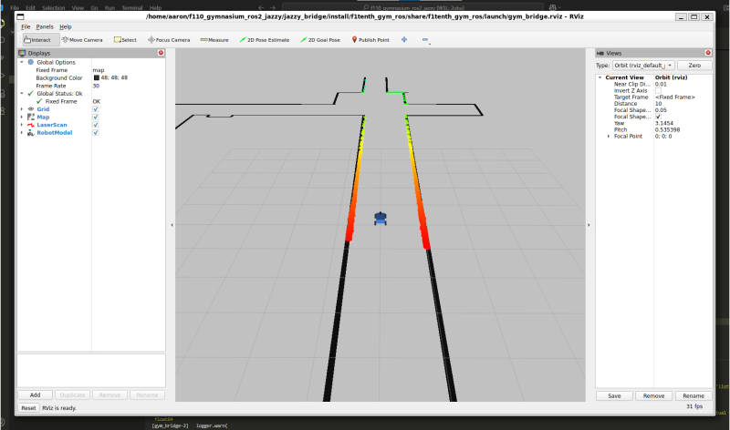

# f110_gymnasium_ros2_jazzy
This repository provides an updated and consolidated framework for simulating 1/10th scale F1TENTH vehicles using the Gymnasium reinforcement learning API and the ROS 2 Jazzy distribution. It merges functionality from four major projects, modernized for compatibility with Ubuntu 24.04, Python 3.12, and ROS 2 Jazzy.

The following repositories have been consolidated:

https://github.com/f1tenth/f1tenth_gym

https://github.com/f1tenth/f1tenth_gym_ros

https://github.com/CL2-UWaterloo/f1tenth_ws

https://github.com/CL2-UWaterloo/Raceline-Optimization


## WSL2 + Ubuntu 24.04 Setup
We recommend using Visual Studio Code on Windows with the Remote - WSL extension for seamless development across WSL2.

To install Ubuntu 24.04 via PowerShell:
```
wsl --install -d Ubuntu-24.04 --name <WhateverNameYouWant>
```
Once installed, ensure your system is up to date:
```
sudo apt update && sudo apt upgrade
```
then 

'git clone https://github.com/ahoop004/f110_gymnasium_ros2_jazzy.git'
## Python 3.12, Pip, and System Package Support
To prepare Python for working alongside ROS:

```
sudo apt-get install python3-pip
```
Then install the Gymnasium environment:
```
cd f110_gymnasium
pip install -e .
cd ..
```


## ROS 2 Jazzy Setup
Follow the official ROS 2 Jazzy installation instructions for Ubuntu 24.04. Ensure to install the optional development tools (ros-dev-tools).
https://docs.ros.org/en/jazzy/Installation/Ubuntu-Install-Debs.html


To make ROS available in every terminal, append this line to your ~/.bashrc:
```
source /opt/ros/jazzy/setup.bash
```
Then source it for the current session:
```source ~/.bashrc
```


move to the jazzy_bridge dir, install dependencies, and build package.
```cd jazzy_bridge
```

>Note: The use of break-system-packages is necessary to install Python packages globally when using ROS2 JAZZY.

```PIP_BREAK_SYSTEM_PACKAGES=1 rosdep install -i --from-path src --rosdistro jazzy -y
```


```colcon build```

then source the package
'source install/local_setup.bash'

Run the jazzy_bridge package.
'ros2 launch f1tenth_gym_ros gym_bridge_launch.py'

If all goes well you schould have a window pop up like this:



## test run with keyboard input
make sure sim runs a controls work with teleop

## extra tools for waypoints and racelines
go over the race line optimization stuff.

